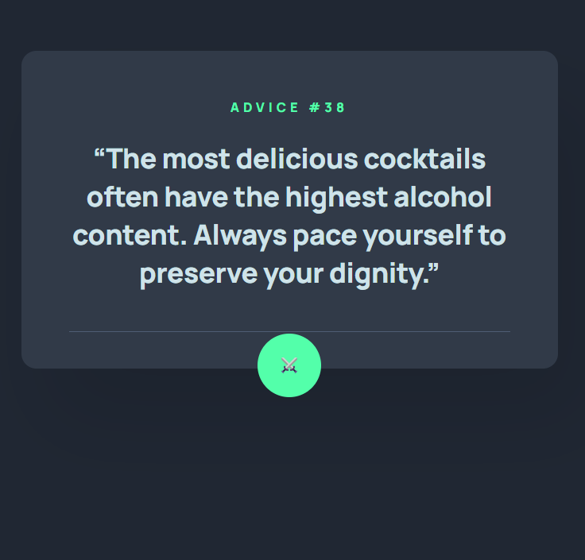

# Advice Generator

## Hoş Geldiniz! 👋

**Bu projenin yapabilmek için temel düzeyde HTML, CSS ve JavaScript bilgisine sahip olmanız gerekir.**

## Proje Tanımı 

Kullanıcılarınızın şunları yapabilmesi gerekmektedir:

- Cihazlarının ekran boyutuna bağlı olarak uygulamanın optimal düzenini görebilmeli (responsive tasarım)
- Sayfadaki tüm etkileşimli öğeler için hover durumlarını görebilmeli
- Zar ikonuna tıklayarak yeni bir öneri oluşturabilmeli

### Projede Kullanılan Api

[Tavsiye Fişi API'sini](https://api.adviceslip.com) 

### Proje Demo & Github

[Demo Baglantı](https://xn--merfrat-80a94c.com/fech-odev/)

[Github Link](https://github.com/acunmedyaakademi/fech-advice-generator/tree/master)